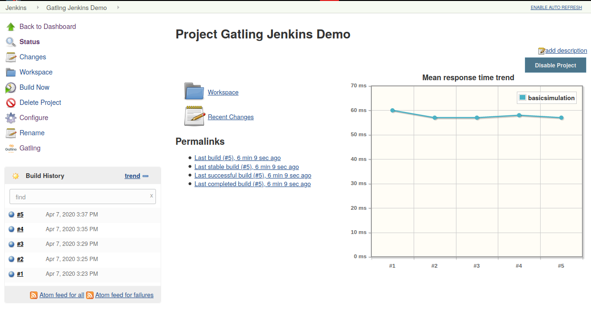

Gatling Jenkins Plugin
======================

This plugin integrates [Gatling](http://gatling.io/), an Open Source
stress tool, with Jenkins.

## Features

This plugin allows you to : 

- Keep track of a Gatling simulation, providing performance trends across builds(Enterprise Only)
- Download the detailed reports for each build

## Changelog

Changelog is now published on github releases

**A [XSS vulnerability](https://jenkins.io/security/advisory/2020-04-07/#SECURITY-1633) was fixed in the version 1.3.0 of the plugin, be careful when using older version of the plugin.**

 If you're coming from 1.0.0, make sure "Enable simulation tracking"
checkbox is checked in your build configuration and if not, check it.

This is an issue with configuration changes between 1.0.0 and 1.0.1
and doesn't affect fresh 1.0.1 installations.

- 1.3.0
    -   Fix [XSS vulnerability](https://jenkins.io/security/advisory/2020-04-07/#SECURITY-1633)
    - Full Gatling HTML reports can no longer be displayed directly online from Jenkins but have to be downloaded locally
- 1.2.7
    -   Fix Gatling plugin not working when called multiple times in a single pipeline
- 1.2.6
    -   Fix unneeded serialization (contributed by jglick) 
- 1.2.5
    -   Fix Trends Links
- 1.2.4
    -   Fix links to run with multiple simulations (contributed by
        pscosta)
- 1.2.3
    -   Fix Gatling Publisher sometimes trying to serialize
        non-whitelisted classes to the disk(contributed by
        oleg-nenashev)
- 1.2.2
    -   Fix 50th percentile trend being displayed instead of the 95th
        percentile trend
    -   Fix trends click, see JENKINS-42622
    -   Render reports without Content-Security-Policy (contributed by
        David Griffiths)
- 1.2.1
    -   Fix Gatling Reports Iframe height
    -   Fix issues with reports display
- 1.2.0
    -   Add compatibility with Jenkins Pipeline
- 1.1.1:
    -   Fix compatibility with Jenkins 1.597+ (contributed by Piotr
        Wielgolaski)
- 1.1.0 :
    -   Support for Gatling 2.1
- 1.0.3 : 
    -   Support multiple reports per build (contributed by Chris Price)
- 1.0.2 :
    -   Allow to run multiples simulations in one build, as long as
        there is only one report created per build
    -   Removed the need to clean projects on every build
- 1.0.1 : 
    -   Ouput directory prefix doesn't need to be specified anymore
    -   Better logging in case of trouble finding a report
- 1.0.0 : 
    -   Initial release

## Configuration

1.  Install Gatling Plugin (via Manage Jenkins -\> Manage Plugins)
2.  Configure your project to execute Gatling simulations, for example
    using the Maven plugin (see [Maven plugin
    demo](https://github.com/gatling/gatling-maven-plugin-demo))
3.  Configure your job :
    1.  For a maven job: add "Track a Gatling load simulation" as a new
        post-build action. Beware that neither your Jenkin's path nor
        your job's name should contain any space.
    2.  For a pipeline job: add a line to your pipeline script:
        *gatlingArchive()*

**Optional configuration**: You can publish Gatling results with the
Jenkins JUnit plugin. Your Gatling simulation needs to have some
assertions, as each Junit testcase is a different Gatling assertion.

1.  Configure the Jenkins plugin with the following Test report XMLs:
    *target/gatling/assertions-\*.xml*
2.  Execute Gatling with the following option:
    *-Dgatling.useOldJenkinsJUnitSupport=true*, for example: *mvn
    gatling:execute -Dgatling.useOldJenkinsJUnitSupport=true*

Gatling Plugin will look for files under your Job Root Directory
(defaults to *`$JENKINS_HOME/yourjobname)`*, so you may need to copy the
results file if you're doing a containerized job.

## Gatling plugin usage

As soon as you've properly configured your job and launched a build,
you'll see two changes on your project dashboard :

-   A new entry will be available in the left summary : Gatling.
-   A graph, displaying the mean response time trend of your last 15
    builds, will appear.

The Gatling entry in the left summary has two purposes, depending on
which page you are.

If you are on the project dashboard, clicking on Gatling will get you to
a more detailed performance trend(Enterprise only), displaying for your last 30 builds :

-   Mean response time trend
-   95th percentiles response time trend
-   Percentage of KO requests

This page will also provides links to download the html reports for all your
builds, at the bottom of the page.

If you are on the summary of a specific build, clicking on Gatling will
get you to a list of all available reports for this build without the graph(Enterprise only).

## Bug Reporting

If you want to report issues, please use [main Gatling project](https://github.com/gatling/gatling).
